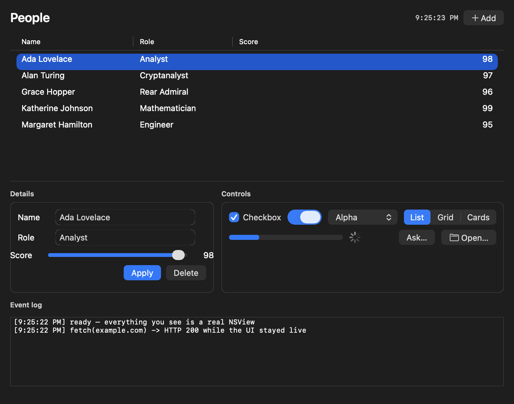
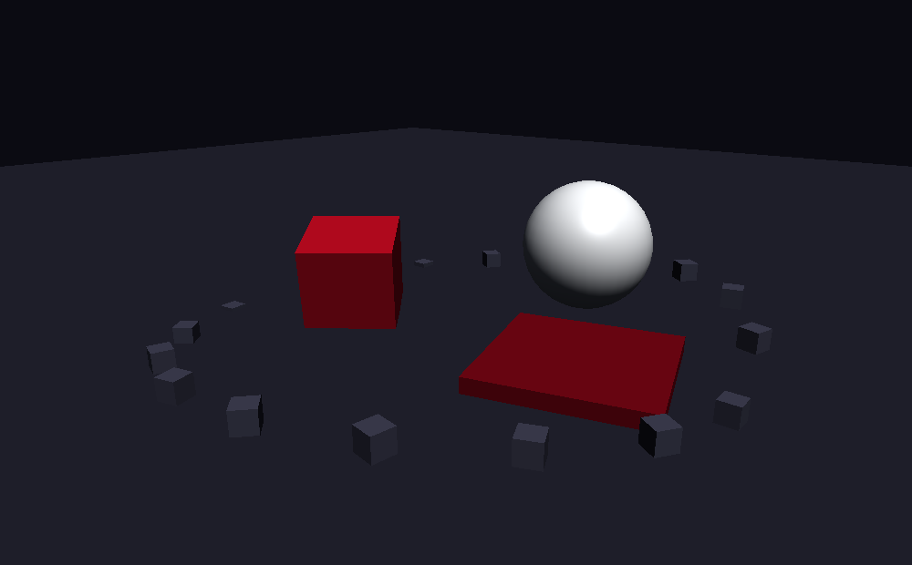
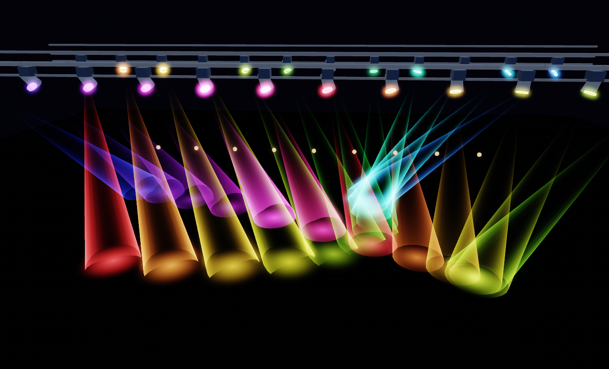

### BunKit

Real AppKit apps for macOS, written in TypeScript on Bun.

[Documentation](https://scarlet.industries/docs/bunkit)

---



bunkit builds mac apps out of actual appkit — windows, tables, menus, sheets — with all of the app logic sitting in typescript. there's no webview anywhere, so the screenshot above is a real `NSTableView` with real `NSTextField`s in it.

```ts
import { Application, Window, VStack, HStack, Label, Button, TextField } from "bunkit";

const app = new Application({ name: "Hello" });

const name = new TextField({ placeholder: "Your name", grow: 1 });
const greeting = new Label({ text: "…" });

new Window({
  title: "Hello",
  size: { width: 360, height: 180 },
  content: new VStack({ spacing: 12, padding: 20 }, [
    new HStack({ spacing: 8 }, [
      name,
      new Button({ title: "Greet", primary: true, onClick: () => {
        greeting.text = `Hello, ${name.value}!`;
      }}),
    ]),
    greeting,
  ]),
}).quitOnClose();

await app.run();
```

### why?

i wanted to know if you could write a proper mac app without shipping a browser to draw it. turns out you can, and it's a lot less work than you'd think, because the objective-c runtime hands you everything you need to call it at runtime. this is also just fun.

### let me try it

you'll need macos on apple silicon, [bun](https://bun.sh) 1.4 or newer, and the xcode command line tools (`xcode-select --install`).

```shell
git clone https://github.com/scarletindustries/bunkit
cd bunkit
bun install
./native/build.sh
```

`bun run hello` is about twenty lines. `bun run tour` is a task list that covers most of the api on one screen. `bun run demo` is the screenshot up top, and `bun run scene` is the 3d one.

to turn something into an actual `.app`:

```shell
bun run bundle examples/demo.ts --name "My App" --id com.example.myapp --icon icon.png
open "dist/My App.app"
```

### how?

ask the objective-c runtime about any method and it'll give you the whole signature back:

```c
method_getTypeEncoding(class_getInstanceMethod(objc_lookUpClass("NSWindow"),
                       sel_registerName("initWithContentRect:styleMask:backing:defer:")))
// -> "@68@0:8{CGRect={CGPoint=dd}{CGSize=dd}}16Q48Q56B64"
```

argument types, return type, struct layouts, all of it, with no headers to parse. so rather than writing a c wrapper per appkit method (and there are tens of thousands of them) there's one bridge that reads that encoding, builds an `ffi_cif` and calls `objc_msgSend` through libffi. it's around 1300 lines and it doesn't need to change when you want a class it's never heard of.

three layers sit on top:

| | | |
|---|---|---|
| `src/ui/` | layer 3 | `Window`, `VStack`, `Button`, `Table`, 26 classes |
| `src/objc.ts` | layer 2 | `objc.NSWindow.alloc().init…()`, marshalling, delegates, blocks |
| `src/bridge.ts` | layer 1 | dlopen, packing arguments into buffers |

layer 3 is the pleasant one. when it doesn't cover what you need you drop to layer 2, which reaches all of appkit — every layer 3 wrapper has a `.native` on it for exactly that.

it goes through libffi instead of using `bun:ffi` on its own because `bun:ffi` wants the signature up front at dlopen time. it can't build one at runtime, can't pass a struct by value, and can't make a function pointer with an arbitrary signature. all three of those are needed here.

the encoding reader, the dispatcher, the closure trampolines, the memory model and the pump are all written up in [the bridge](https://scarlet.industries/docs/bunkit/bridge).

### 3d

there's a metal renderer in the box. `Scene3D` is a view like any other, so it drops into a stack next to the labels and buttons.



```ts
const scene = new Scene3D({ grow: 1, camera: { position: [4, 2.6, 5] } });

scene.add(plane({ size: 40, color: "#20202a" }));
const cube = scene.add(box({ size: 1.1, position: [0, 0.55, 0], color: "#aa091b" }));

scene.onFrame(({ dt }) => { cube.rotation.y += dt; });
```

`box`, `sphere`, `plane`, `cylinder` and `cone`, or your own vertex data through `geometry()`. nodes that share a shape and a material get batched into one instanced draw, so the draw call count follows the number of distinct meshes rather than the number of objects. two hundred cubes is one draw.

`bun run scene` is that example.

### shaders

the layer under `Scene3D` is a typed gpu api. it borrows [typegpu](https://github.com/software-mansion/TypeGPU)'s idea — declare a struct once, generate both the byte layout and the msl from it — and adds the other direction, because metal's compiler will tell you the layout it decided on.

so you can start from the schema:

```ts
const Globals = struct("Globals", { viewProjection: mat4x4f, time: f32 });

const pipeline = gpu().renderPipeline({
  shader: msl`
    ${Globals}
    vertex float4 vs(constant Globals &g [[buffer(0)]]) { ... }
    fragment float4 fs() { ... }
  `,
});
```

or skip it entirely and let the compiler describe the struct you already wrote:

```ts
pass.pipeline(pipeline).bind({
  g: { viewProjection, time: 0.4 },   // packed using metal's own offsets
  albedo: texture,                     // right stage, right index
});
```

`bind` takes the names out of the shader. there are no buffer indices to keep in sync on this side, and renumbering `[[buffer(2)]]` can't quietly break the caller — a name that doesn't exist throws and lists the ones that do.

entry points get found the same way. one vertex function and one fragment function in the library means you don't name either.

a full-screen effect is a string:

```ts
const invert = gpu().effect(`return float4(1.0 - src.sample(smp, uv).rgb, 1.0);`);

frame.effect(invert, { to: screen, bind: { src: sceneTexture } });
```

`src`, `smp` and `uv` are in scope, the sampler gets bound for you, and the triangle gets drawn for you. pass a whole `fragment` function instead when one expression isn't enough — it's an ordinary pipeline underneath, so `bind` still finds whatever you declared.

compute is the same shape. `gpu().kernel(source)` finds the entry point, `kernel.run(n, bindings)` dispatches it, and `frame.dispatch(...)` puts it in the same command buffer as the drawing so the simulation and the draw that reads it are ordered by the gpu instead of a cpu wait.

`src/metal/shaders.ts` has the msl you'd otherwise retype: aces, colour temperature in kelvin, ordered dither, value noise and fbm, sdfs, cone falloff. they're snippets — interpolate one and its dependencies come with it, deduplicated.

### a rig



twenty-four moving heads, each with a yoke, a head, a volumetric beam and a pool on the floor, re-aimed from javascript every frame. hdr into a bloom chain and an aces tone map, msaa, 220 nodes, **9 draw calls**, and 0.027ms to build and encode a frame.

it stays cheap because nothing scales with the object count. a draw call costs about 1.2µs from js, and writing twenty thousand instance structs into a shared buffer costs 0.05ms in total — so per-object draws are roughly 25,000× the cost of per-instance writes, and everything here is a per-instance write. adding another hundred fixtures adds no draw calls.

frames are paced to the display rather than run free. presenting faster than the refresh changes nothing you can see, `nextDrawable` blocks on vsync anyway, and decoupling just presents staler state — which for anything synced to music is worse than a lower frame rate. the view keeps at most two command buffers outstanding and skips a tick when the gpu hasn't caught up, so the run loop never blocks.

completion is polled rather than handled. metal calls `addCompletedHandler:` on its own thread and a js callback entered from there deadlocks bun, so the status gets read at the top of the next tick from the thread that's allowed to read it.

hold the right mouse button to look around and fly with wasd. input is polled rather than delivered — `keys.held("w")` asked once per frame, inside the frame callback, which is what a loop wants and what a callback API makes awkward:

```ts
const keys = view.input;

scene.onFrame(({ dt }) => {
  if (keys.held("w")) move(forward, speed * dt);
  if (keys.pressed("space")) jump();          // true on exactly one frame
  yaw -= keys.mouse.dx * 0.005;               // zero on a frame with no motion
});
```

it's one application-wide `NSEvent` monitor rather than an `NSView` subclass, so it sees every key regardless of which control has focus, and it passes every event straight through — nothing else in the app notices. key codes map by position, so wasd stays under the same fingers on an azerty keyboard.

`bun run rig` is the example.

it's a `CAMetalLayer` rather than an `MTKView`, so frames come from bunkit's run loop instead of a second one. `.native` is on every object if you want the raw obj-c, and `scene.capture()` / `scene.snapshot()` read the framebuffer back — which is how all of this is tested, since nobody is watching.

### the annoying parts

appkit runs its own nested run loop for modal dialogs, menu tracking, live resize and drags, and js is frozen the whole time it's in there. dialogs were the worst of it, so layer 3 gives you sheets instead: `alert`, `confirm`, `prompt`, `openFile` and `saveFile` all hand you a promise and the pump keeps ticking underneath. `alert` and `prompt` fall back to a blocking modal when there's no window to hang a sheet on, which is the only place `runModal` gets reached. menu tracking and live resize you just live with. they're bounded by someone letting go of the mouse.

pointers are `bigint`, not `number`. apple packs short strings and small numbers into the pointer itself, which pushes the value past 2^53. compare against `0n`.

arm64 only. struct returns there go through plain `objc_msgSend` with x8 holding the result pointer, so the whole `objc_msgSend_stret` family doesn't exist in the dispatcher. the build script and the bundler both refuse an intel target rather than build you something that returns structs wrong.

enum values come out of a generator rather than out of my head. `NSTextAlignment` on arm64 uses the ios ordering (left, center, right) and not appkit's older one (left, right, center), which i typed in by hand and then spent a while wondering why everything i right-aligned was centred. `tools/gen-constants.ts` recovers 5521 of them by compiling a probe against the sdk, and `tools/gen-types.ts` walks the live runtime for the classes and protocols so layer 2 autocompletes.

### where it's at

it works, and there's a decent amount of test coverage — marshalling, layout geometry, synthetic mouse and keyboard events, run loop behaviour, and a soak test for leaks.

```shell
bun test
bun run typecheck
```

a `msgSend` costs about 230ns, a callback from obj-c into js about 870ns, and idle cpu with a window open sits around 1.3%. a sixty second soak of several million calls holds flat.

still missing: notarization (it only ad-hoc signs), an npm package (the dylib has to be compiled, so that needs prebuilt binaries), and swiftui hosting.

### contributing

issues and prs welcome. run `./native/build.sh && bun run typecheck && bun test` before you open one. `CLAUDE.md` has the conventions and the traps in it.

like carder, a lot of this gets written by claude. if you want to take on something substantial, hit me up on discord (@hiett) first so we're not doing the same work twice.

### the name

bunkit is not affiliated with bun, or with oven, the company behind it. the name is descriptive: bun is the only runtime it runs on. `bun:ffi` is what crosses into the dylib, and bun's event loop is what the pump hands the thread back to between slices, so it won't run under node or deno.

### license

bunkit is licensed under the [Apache License 2.0](LICENSE). you're free to use, modify, and distribute it — including in commercial and closed-source products — provided you keep the license and attribution notices intact. the Apache license also carries an explicit patent grant. see [LICENSE](LICENSE) and [NOTICE](NOTICE) for the full terms.
