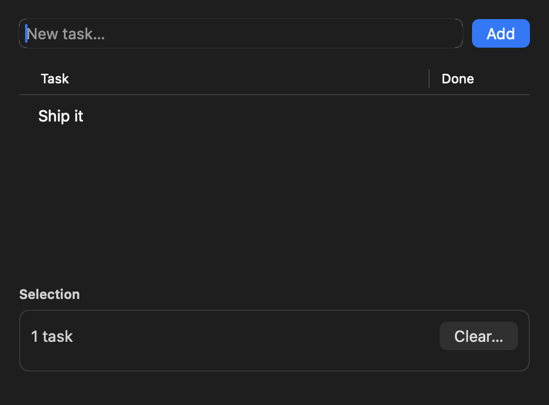

### BunKit

Real AppKit applications for macOS, written entirely in TypeScript on Bun.

[Getting started](#getting-started) • [scarlet.industries](https://scarlet.industries)

---

`NSWindow`, `NSTableView`, `NSStackView`, menus, sheets — no WebView, no HTML, no Electron.


```ts
import { Application, Window, VStack, HStack, Label, Button, TextField } from "bunkit";

const app = new Application({ name: "Hello" });

const name = new TextField({ placeholder: "Your name", width: 200 });
const greeting = new Label({ text: "…" });

new Window({
  title: "Hello",
  size: { width: 360, height: 180 },
  content: new VStack({ spacing: 12, padding: 20 }, [
    new HStack({ spacing: 8 }, [
      name,
      new Button({ title: "Greet", primary: true, onClick: () => {
        greeting.text = `Hello, ${name.value}!`;
      }}),
    ]),
    greeting,
  ]),
}).quitOnClose();

await app.run();
```

## Getting started

Requires macOS on Apple silicon, [Bun](https://bun.sh), and the Xcode command-line tools
(`xcode-select --install`) for clang and the SDK.

```bash
git clone https://github.com/scarletindustries/bunkit
cd bunkit
bun install
./native/build.sh          # compile the bridge, once

bun run hello              # 20 lines
bun run tour               # a small task list — the API in one screen
bun run demo               # the app in the screenshot above
```

To ship it:

```bash
bun run bundle examples/demo.ts --name "My App" --id com.example.myapp --icon icon.png
open "dist/My App.app"
```

---

## How it works

The whole design turns on one fact: **the Objective-C runtime is fully introspectable at
runtime.** Given a class and a selector you can ask it for the complete type signature of
any method — argument types, return type, struct layouts — with no header parsing and no
metadata files:

```c
method_getTypeEncoding(class_getInstanceMethod(objc_lookUpClass("NSWindow"),
                       sel_registerName("initWithContentRect:styleMask:backing:defer:")))
// -> "@68@0:8{CGRect={CGPoint=dd}{CGSize=dd}}16Q48Q56B64"
```

So instead of hand-writing a C wrapper per AppKit method — thousands of them, each one a
recompile — there is **one** generic bridge that parses that encoding, builds an `ffi_cif`,
and calls `objc_msgSend` through libffi. It is 1,300 lines and 54 exported symbols, and it
never has to grow when you want to use a new AppKit class.

```
┌──────────────────────────────────────────────┐
│  your app (TypeScript)                       │
├──────────────────────────────────────────────┤
│  Layer 3  src/ui/       Window, VStack, …    │  hand-written, ~30 classes
├──────────────────────────────────────────────┤
│  Layer 2  src/objc.ts   objc.NSWindow.…      │  Proxy, marshalling, delegates
├──────────────────────────────────────────────┤
│  Layer 1  src/bridge.ts dlopen, arg packing  │
├══════════════════════════════════════════════┤  ← FFI boundary
│  build/libobjcbridge.dylib  (Obj-C + libffi) │
├──────────────────────────────────────────────┤
│  AppKit / Foundation / CoreGraphics          │
└──────────────────────────────────────────────┘
```

**Why libffi and not `bun:ffi` directly:** `bun:ffi` needs a fixed signature at `dlopen`
time. It cannot build a call signature at runtime, cannot pass structs by value (an
`NSRect` is four doubles passed in registers under the arm64 HFA rules), and cannot mint
function pointers with arbitrary signatures — all three of which this needs. `bun:ffi`'s job is just
to call the shim's handful of stable entry points.

---

## Layer 3 — the ergonomic layer

Declarative to build, imperative to update. No virtual DOM: AppKit views are stateful,
retained objects and diffing them is a category error.



- **Layout** — `VStack` / `HStack` over `NSStackView`, plus `Spacer`, `ScrollView`,
  `GroupBox`, `SplitView`, `BlurView`. Raw anchors stay reachable via `view.constrain()`.
- **Controls** — `Label`, `Button` (incl. SF Symbols), `TextField`, `TextArea`, `Checkbox`,
  `Switch`, `Slider`, `Select`, `Segmented`, `Progress`, `ImageView`.
- **Data** — `Table` wraps `NSTableView`'s pull-based datasource around a JS array and a
  renderer.
- **Chrome** — `standardMenu()` builds the conventional macOS menu bar; `Window` exposes
  `onClose` / `onResize` / `onFocus` rather than a delegate object.
- **Dialogs** — `alert`, `confirm`, `prompt`, `openFile`, `saveFile`: all async, all sheets.

Two layout rules are worth knowing, because they are the ones AppKit does not give you:

- **Cross-axis `fill`** is implemented with explicit constraints. `NSStackView`'s
  `alignment` silently ignores `Width`/`Height`, so "make every row full width" has to be
  said another way.
- **Growth along the main axis is opt-in** (`grow: 1`). Otherwise whichever view happens to
  have the lowest built-in hugging priority silently swallows all the spare space, which is
  impossible to reason about. A column packs to the top; a row shares its slack.
- **Sizes in `ViewOptions` are strong preferences, not promises.** `width: 220` is applied
  just below Required, and a `fill` stack clamps its children to the padded area at
  Required. So content that no longer fits compresses instead of drawing over its
  container's border — which is what Auto Layout does by default when it breaks the
  weakest constraint. `checkLayout(window)` reports anything that still escapes.

Anything not covered drops through: every wrapper has `.native`, and `objc.AnyClass` reaches
the rest of AppKit.

---

## Layer 2 — Objective-C in JavaScript

```ts
import { objc, createDelegate, createBlock } from "bunkit/objc";

const win = objc.NSWindow.alloc().initWithContentRect_styleMask_backing_defer_(
  { x: 0, y: 0, width: 480, height: 320 },   // structs are plain objects
  15, 2, false,
);
win.setTitle_("Hi");
win.frame();            // -> { x, y, width, height }
String(win.title());    // -> "Hi"
```

Selector spelling: `initWithContentRect:styleMask:backing:defer:` becomes
`initWithContentRect_styleMask_backing_defer_`. Ugly but mechanically reversible. A literal
underscore in a selector is written `$`.

**Delegates** are plain objects. A runtime Obj-C class is created per distinct *shape*
(set of selectors) and cached; each instance carries a token identifying its JS handler
table, so a thousand delegates do not leak a thousand classes:

```ts
win.setDelegate_(createDelegate({
  windowWillClose_: () => app.quit(),
  windowShouldClose_: () => confirmed,      // BOOL comes back through the trampoline
}, { protocols: ["NSWindowDelegate"] }));
```

**Blocks** need their signature supplied, because a block parameter is encoded only as
`@?` — the runtime does not know what is inside it:

```ts
// void (^)(id obj, NSUInteger idx, BOOL *stop)
array.enumerateObjectsUsingBlock_(createBlock("v@?@Q^B", (obj, idx, stop) => { … }));
```

### Pointers are BigInt

Objective-C object pointers are `bigint`, never `number`. Apple encodes short `NSString`s,
small `NSNumber`s and `NSDate`s directly in the pointer ("tagged pointers"), which sets the
high bits and puts the value far beyond 2^53. Compare against `0n`.

### Memory

Every live wrapper holds exactly one retain, released by a `FinalizationRegistry`.
Methods in the `alloc`/`new`/`copy`/`mutableCopy` families hand over an ownership, so no
extra retain is taken; the `init` family transfers the receiver's ownership to the result,
and if `init` returns a *different* object the receiver's wrapper is disowned so it cannot
double-release. Two calls returning the same pointer produce the same JS wrapper, so `===`
and event-handler lookup both work. `FinalizationRegistry` timing is not guaranteed, so
anything holding a scarce resource also has `.dispose()`.

Three things had to be got right, all of them found by `test/soak.ts` rather than by
reading the code:

- **Argument temporaries are released, not autoreleased.** An argument only has to outlive
  the call, and a callee that keeps it is required to retain it — which is exactly what
  ARC does with a temporary at the end of a statement. Autoreleasing instead makes every
  marshalled string depend on a pool drain.
- **The base autorelease pool is recycled every pump.** Most Obj-C calls happen *between*
  pumps, and every `+0` autoreleased return lands in the innermost pool — the
  process-lifetime one, unless something drains it. Without that, RSS climbed to 1.7 GB in
  twenty seconds.
- **Delegate handler tables are held weakly.** A delegate's handlers close over the object
  that owns them (a `Window` closes over itself in `onClose`), and that object holds the
  delegate. A global strong table would root the whole cycle, so the wrapper's finalizer
  could never run and every window ever opened would stay alive — 11 leaked wrappers per
  window. The table is kept alive by the delegate wrapper instead, which is the lifetime
  you actually want.

### Errors

Objective-C exceptions are caught at the FFI boundary and rethrown as JS `Error`s with a JS
stack trace, rather than terminating the process:

```
NSRangeException: *** -[__NSArray0 objectAtIndex:]: index 99 beyond bounds for empty array
```

Calling a selector a class does not implement throws immediately, with suggestions:

```
-[NSWindow setTitel:] is not implemented (unrecognized selector)
  did you mean: setTitle:, setTitleVisibility:, setTitlebarAppearsTransparent:
```

---

## The run loop

AppKit's run loop and Bun's event loop both want the main thread. `[NSApp run]` is never
called. Instead JS owns the outer loop and hands AppKit short slices:

```ts
while (running) {
  recycleAutoreleasePool();
  const handled = pump(idle ? 0.002 : 0.004);   // blocks in mach_msg
  await Bun.sleep(idle ? 8 : 0);                // Bun's turn
}
```

The split matters. Time spent blocked *inside* AppKit is time Bun's event loop cannot run,
so while the app is quiet most of the waiting is done in `Bun.sleep` instead. Measured on an
M-series Mac with a window open:

| cadence | idle CPU | `setInterval(20ms)` accuracy |
|---|---|---|
| pump 8ms, `sleep(0)` | 1.5% | 79% |
| **pump 2ms, `sleep(8ms)`** — the default | **1.3%** | **95%** |
| + deep-idle backoff to `sleep(16ms)` | 1.0% | 83% at 16ms |

All of it is tunable through `RunOptions`. Deep-idle backoff is off by default: it buys 0.3
points of CPU and costs a 16ms animation timer about 9 points of accuracy, which is the
wrong trade unless you know the app never animates while idle.

### The unavoidable caveat: nested run loops

AppKit spins its *own* nested run loop — and `pump` does not return — during modal dialogs,
menu tracking, live window resize, scroll momentum, drag sessions, and **mouse-down tracking
in a control** (`-[NSCell trackMouse:…]` does not return until it sees the mouse-up). While
that is happening, JavaScript is frozen.

The mitigation that removes the largest category of freezes: **Layer 3 never exposes
`runModal*`.** Every dialog is a sheet with a completion handler, so the pump keeps running
and the API is a promise. The rest — menu tracking, live resize — is bounded by human
interaction and simply documented. Don't rely on a timer firing during a window drag.

If that ever becomes unacceptable the fix is two processes (a native host owning the run
loop, Bun as a child over a socket). Layer 3's API is already async where it needs to be, so
that would be a transport swap rather than a rewrite.

---

## Codegen

Runtime introspection gives you methods. It does not give you enum values — those are
compile-time constants and nothing at runtime knows them. So `tools/gen-constants.ts` asks
the only authority that does: it sweeps the SDK headers for candidate identifiers, emits an
Objective-C++ probe that prints each one, and iterates — dropping whatever clang rejects —
until it compiles. 5,521 constants, cross-checked against clang's own AST dump.

This is not academic. On arm64 macOS `NSTextAlignment` uses the *iOS* ordering
(Left=0, Center=1, Right=2), not AppKit's historical Left/Right/Center. A hand-written
table gets this wrong and silently centres everything you asked to right-align — which is
exactly what happened here before the generator existed. `src/ui/appkit.ts` now *derives*
its grouped enums from the generated file and throws at import time if a name disappears.

`tools/gen-types.ts` goes the other way: it walks the live Obj-C runtime through the bridge
itself and emits `src/generated/appkit.d.ts` — 3,035 classes and 465 protocols — so Layer 2
autocompletes and typos are type errors instead of runtime crashes. Protocols matter as much
as classes: `NSWindowDelegateHandlers` tells you what a window delegate *can* implement, and
types it, including the awkward ones:

```ts
const handlers: NSWindowDelegateHandlers = {
  windowShouldClose_: (window) => true,                      // BOOL return
  windowWillResize_toSize_: (window, size) => ({ ...size }), // struct in, struct out
};
```

The types are deliberately narrow where the runtime is: a 64-bit return is
`number | bigint`, not `number`, because `NSNotFound` really does come back as a BigInt;
and `-[NSMenuItem action]` is `string | null`, because an unset selector really is nil.

```bash
bun run gen                # both generators
```

Regenerate per macOS SDK; the output is committed, so a clone does not need Xcode until it
wants to rebuild the dylib.

---

## Packaging

```bash
bun run bundle examples/demo.ts --name "My App" --id com.example.myapp --icon icon.png
```

Produces a real `.app` — `Info.plist`, the compiled Bun binary in `Contents/MacOS`, the
dylib in `Contents/Frameworks`, an `.icns` built with `sips`/`iconutil`, ad-hoc codesigned
(dylib first, then the bundle). A bundle is not optional on macOS: without one you get the
wrong menu-bar name, odd Dock behaviour, and several APIs that quietly misbehave. Pass
`--sign "Developer ID Application: …"` for a distributable build.

---

## Tests

```bash
bun test                    # all of the below, each in its own process
bun run test/layer2.ts      # marshalling, structs, delegates, blocks, exceptions, GC
bun run test/edge.ts        # C functions, out-params, subclassing, odd encodings, nil
bun run test/constants.ts   # generated values, incl. round-trips through AppKit
bun run test/types-check.ts # the generated .d.ts, checked at compile *and* run time
bun run test/layout.ts      # geometry assertions on five real layouts
bun run test/input.ts       # synthetic NSEvents -> JS callbacks
bun run test/runloop.ts     # idle CPU, timer accuracy, throughput
bun run test/soak.ts        # 3,000 rounds of churn; wrapper count and RSS must flatten
bun run test/examples.ts    # every example starts and stays up
```

Each suite runs in its own process because `NSApplication` is a per-process singleton whose
state (menu bar, key window, activation) leaks between them.

`test/input.ts` is the one that matters most: it posts real `NSEvent`s — mouse clicks,
keystrokes, `cmd+D` — and asserts they arrive as JS callbacks with the right arguments.

Layouts are verified without a human looking at the screen, by asking views to draw
themselves into a bitmap (`snapshotWindow`, which needs no screen-recording permission) and
by asserting on geometry. Note that `frame` and `alignmentRect` differ: an `NSTextField`
draws two points outside the rectangle Auto Layout actually constrains, so a width
constraint of 60 produces a frame 64 wide. Assert on `alignmentRect`.

Worth running under zombies before a release — it catches over-releases, which are otherwise
invisible until they are a crash in someone else's code:

```bash
NSZombieEnabled=YES MallocScribble=1 bun run test/soak.ts
```

One behaviour worth knowing: `app.run()` ends the process when it returns. A GUI app almost
always has a `setInterval` running, and an interval keeps Bun's event loop alive forever —
so without that, the window would disappear and the process would hang. Put shutdown work in
`onQuit`, not after `await app.run()`.

### Measured

| | |
|---|---|
| `msgSend` (`-length`) | 229 ns |
| `msgSend` returning a struct (`-frame`) | 263 ns |
| `msgSend` taking a struct (`-setFrame:`) | 886 ns |
| Obj-C → libffi closure → JS callback | 870 ns |
| Idle CPU with a window open | 1.3% |
| 60s soak, 9.8M `msgSend` calls | wrappers flat; RSS +2 MB in the second half |

---

## Status

Working and tested end to end on macOS 26 / SDK 26.0.

**Apple silicon only.** This is a deliberate simplification rather than a gap: on arm64
every struct return goes through plain `objc_msgSend` with `x8` as the indirect result
register, so the whole `objc_msgSend_stret` / `_fpret` family and the SysV return
classification simply do not exist in the dispatcher. Intel is not coming back. The build
script and the bundler both refuse a non-arm64 target rather than producing something that
would return structs wrongly.

What is *not* done, so you know before you invest:

- **Notarization.** The bundler ad-hoc signs, which is enough to run locally and enough as
  the basis for a `--sign`'d Developer ID build. Stapling and the notary service are not
  wired up.
- **No npm package yet.** The dylib has to be compiled, which means either a build step on
  install or prebuilt binaries per architecture. Clone it for now.
- **Idle CPU is 1.3%**, not the sub-1% that would be ideal. The knob to reach 1.0% exists
  and is documented above; it is off by default because of what it costs.
- **SwiftUI islands** (hosting SwiftUI views in `NSHostingView`) are not built. Nothing in
  the design prevents it — it would be a `View` subclass — but SwiftUI's API has no C-ABI
  representation, so it could only ever be a black box with a serialised interface.

## Layout

```
native/src/     bridge.h, encoding.m, dispatch.m, closures.m, memory.m, runloop.m
native/build.sh
src/bridge.ts   Layer 1 — dlopen, signature layouts, buffer pool
src/objc.ts     Layer 2 — proxy, marshalling, delegates, blocks
src/structs.ts  CGRect & friends
src/runtime.ts  the pump
src/ui/         Layer 3
src/generated/  constants.ts, appkit.d.ts   (committed; regenerate per SDK)
tools/          gen-constants.ts, gen-types.ts, bundle.ts
examples/       hello.ts, tour.ts, demo.ts, raw-objc.ts
test/
```

## Contributing

Issues and pull requests welcome. Before opening one:

```bash
./native/build.sh && bun run typecheck && bun test
```

`CLAUDE.md` documents the conventions and the handful of things that reliably bite people
working in this codebase.

## Licence

Apache-2.0. See [LICENSE](LICENSE) and [NOTICE](NOTICE).
